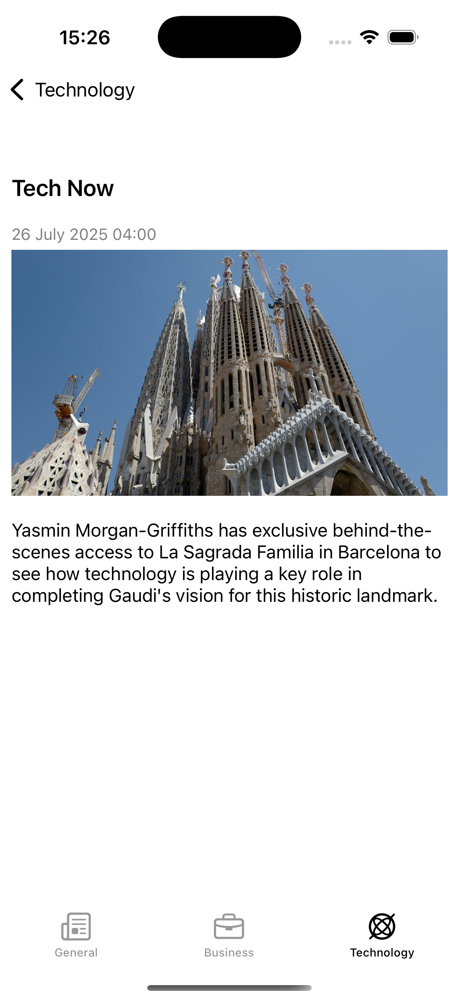

# News-app

NewsApp is an iOS news reader built in Swift with MVVM and SnapKit, fetching articles from NewsAPI with images, categories, keyword search, and robust network error handling.

     
---

## Features
- Fetches news from **NewsAPI**  
- Displays articles with images and categories  
- Search news by keywords  
- Handles network errors gracefully  
- MVVM architecture
- Adaptive layout with SnapKit  
- TabBar-based navigation  
